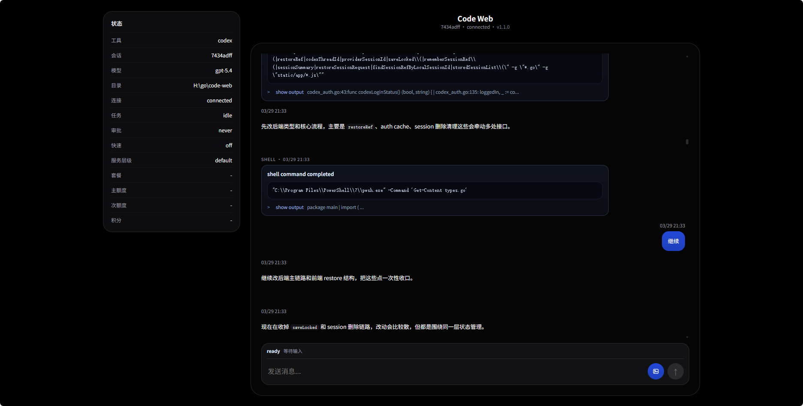
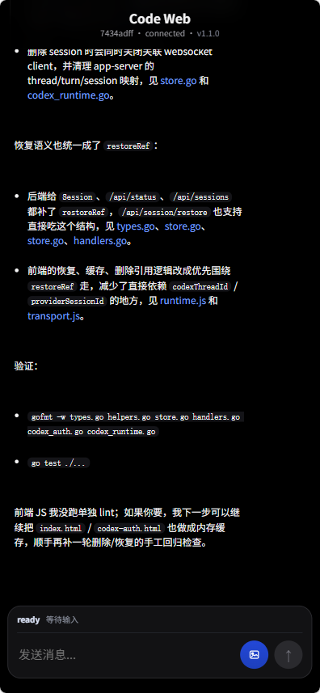

<p align="right">
  <a href="./README.md">中文</a> | English
</p>

# <p align="center">Code Web</p>

<p align="center">
  
  
  
</p>
<p align="center">
  <a href="./README.md">中文</a> | English
</p>

`Code Web` is a coding assistant Web UI built with `Go + HTML + WebSocket`, currently supporting both `Codex` and `Claude`.

It targets mobile and desktop browsers, and aims to bring the continuous session experience of local coding assistant CLIs into the browser:

- Tasks keep running on the server after the browser is closed
- Reopening the page restores the latest chat automatically

## Screenshots




## Features

- In `codex` mode it runs on top of `codex app-server`, instead of starting a fresh standalone CLI process for every message
- Supports resumable sessions through the `Claude` headless CLI
- Sessions are no longer persisted on the server; the browser stores remote session references for restore
- Supports sending images together with messages
- Supports streaming output, `Working...` status feedback, and automatic reconnect
- Supports basic Markdown rendering
- Frontend static assets are embedded into the binary, so no separate `static/` directory is required

## Requirements

1. Go `1.22+`
2. The matching provider CLI must be directly executable on the machine
   - `codex` mode requires `codex`
   - `claude` mode requires `claude`
3. If you use `codex` mode, `codex login` must already be completed

## Config Files

By default, the program reads these two config files from the current working directory where the binary runs:

- `claude-settings.json`
  - Configuration for Claude sessions
  - You can use `claude-settings.json` to configure environment variables such as proxies, models, and related settings
- `codex-settings.json`
  - Currently used to inject extra environment variables into `codex app-server`

Example `claude-settings.json`:

```json
{
  "env": {
    "ANTHROPIC_AUTH_TOKEN": "ms-******-ba92-4416-*****-d93c1124a9f9",
    "ANTHROPIC_BASE_URL": "https://api-inference.modelscope.cn",
    "ANTHROPIC_DEFAULT_HAIKU_MODEL": "ZhipuAI/GLM-5",
    "ANTHROPIC_DEFAULT_OPUS_MODEL": "ZhipuAI/GLM-5",
    "ANTHROPIC_DEFAULT_SONNET_MODEL": "ZhipuAI/GLM-5",
    "ANTHROPIC_MODEL": "ZhipuAI/GLM-5"
  }
}
```

Example `codex-settings.json`:

```json
{
  "env": {
    "HTTP_PROXY": "http://127.0.0.1:10808",
    "HTTPS_PROXY": "http://127.0.0.1:10808"
  }
}
```

## Start

```bash
go build -o code-web
./code-web
```

For deployment you only need the binary itself and the runtime `data/` directory.

Default listen address:

```text
0.0.0.0:991
```

## Login Password

You can set the login password with a startup flag:

```bash
./code-web -password "123456"
```

If not specified, the default password is:

```text
codex
```

## Access

Open this URL in your browser:

```text
http://YOUR_SERVER_IP:991
```

## Reverse Proxy

If you put it behind Nginx, you at least need to forward WebSocket traffic:

```nginx
location / {
    proxy_pass http://127.0.0.1:991;
    proxy_http_version 1.1;
    proxy_set_header Upgrade $http_upgrade;
    proxy_set_header Connection "upgrade";
    proxy_set_header Host $host;
}
```

## Notes

- This project is not an official OpenAI product
- It is a Codex / Claude Web wrapper intended for personal deployment
- The current implementation prioritizes continuous sessions, recovery, and mobile usability

## License

This project is licensed under `MIT`. See [LICENSE](./LICENSE).
